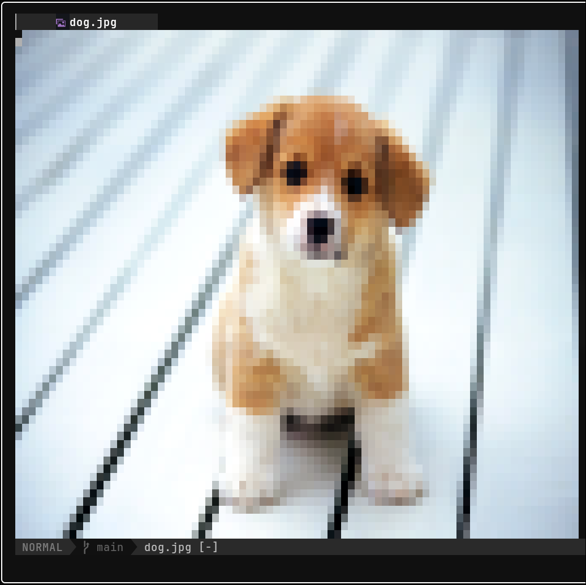

# rndr.nvim

Render images and simple 3D assets directly inside the current Neovim buffer.

`rndr.nvim` pairs a Lua plugin with a native C++ renderer. Open an image or model, run `:RndrOpen`, and the buffer is replaced with an in-place preview you can rerender, rotate, and restore.

## Showcase



<video src="https://raw.githubusercontent.com/SalarAlo/rndr.nvim/main/showcase/box_showcase.mp4" controls muted loop playsinline width="100%"></video>

## What It Supports

- Raster images: `png`, `jpg`, `jpeg`, `gif`, `bmp`, `webp`, `tga`, `psd`, `hdr`, `pic`, `pnm`, `ppm`, `pgm`, `pbm`
- Vector images: `svg`, `svgz`
- Models: `obj`, `fbx`, `glb`, `gltf`, `dae`, `3ds`, `blend`, `ply`, `stl`, `x`, `off`
- SVG rasterizers: `rsvg-convert`, `magick`, or `convert`

## Requirements

Required:

- Neovim with Lua support
- `git`
- CMake `3.16+`
- A C++23-capable compiler

Optional:

- `rsvg-convert`, `magick`, or `convert` for SVG rendering


## Plugin Manager Setup

`lazy.nvim`:

```lua
{
  "SalarAlo/rndr.nvim",
  build = "make",
  config = function()
    require("rndr").setup()
  end,
}
```

`packer.nvim`:

```lua
use({
  "SalarAlo/rndr.nvim",
  run = "make",
  config = function()
    require("rndr").setup()
  end,
})
```

If `make` is unavailable:

```lua
{
  "SalarAlo/rndr.nvim",
  build = "./scripts/build_renderer.sh",
}
```

If you keep the binary somewhere else, override `renderer.bin` in `setup()`.

## Install

Clone the repository and build the native renderer:

```bash
git clone https://github.com/SalarAlo/rndr.nvim.git
cd rndr.nvim
make
```

This produces the renderer binary at `renderer/build/rndr`.

`make` is a thin wrapper around `./scripts/build_renderer.sh`. If you prefer raw CMake commands:

```bash
cmake -S renderer -B renderer/build -DCMAKE_BUILD_TYPE=Release
cmake --build renderer/build --parallel --config Release
```

## Quick Start

Minimal setup:

```lua
require("rndr").setup({
  preview = {
    auto_open = false,
  },
})
```

Open a supported file and run:

```vim
:RndrOpen
```

Or render a specific file directly:

```vim
:RndrOpen lua/examples/dog.jpg
```

Check whether the renderer binary and optional SVG tools are available:

```vim
:checkhealth rndr
```

## Commands

- `:RndrOpen [path]`
- `:RndrClose`
- `:RndrRotateLeft`
- `:RndrRotateRight`
- `:RndrRotateUp`
- `:RndrRotateDown`
- `:RndrResetView`

Rotation commands only affect model files.

## Configuration

```lua
require("rndr").setup({
  preview = {
    auto_open = false,
    events = { "BufReadPost" },
    render_on_resize = true,
  },
  assets = {
    images = { "png", "jpg", "jpeg", "gif", "bmp", "webp" },
    vectors = { "svg", "svgz" },
    models = { "obj", "fbx", "glb", "gltf", "dae", "blend", "ply", "stl" },
  },
  window = {
    termguicolors = true,
    size = {
      width_offset = 0,
      height_offset = 0,
      min_width = 1,
      min_height = 1,
    },
    options = {
      number = false,
      relativenumber = false,
      wrap = false,
      signcolumn = "no",
    },
  },
  renderer = {
    bin = "/absolute/path/to/rndr.nvim/renderer/build/rndr",
    supersample = 2,
    brightness = 1.0,
    saturation = 1.18,
    contrast = 1.08,
    gamma = 0.92,
    background = "0d0f14",
  },
  controls = {
    rotate_step = 15,
    keymaps = {
      close = "q",
      rerender = "R",
      reset_view = "0",
      rotate_left = "h",
      rotate_right = "l",
      rotate_up = "k",
      rotate_down = "j",
    },
  },
})
```

## Manual Renderer Usage

The renderer can also be called directly:

```bash
./renderer/build/rndr <file> <term-width> <term-height> [supersample] [yaw] [pitch] [brightness] [saturation] [contrast] [gamma] [background]
```

## Project Layout

```text
.
├── lua/rndr/             # Neovim plugin code
├── lua/examples/         # Sample assets
├── renderer/             # Native renderer built with CMake
├── scripts/              # Build helpers
└── showcase/             # README media
```
